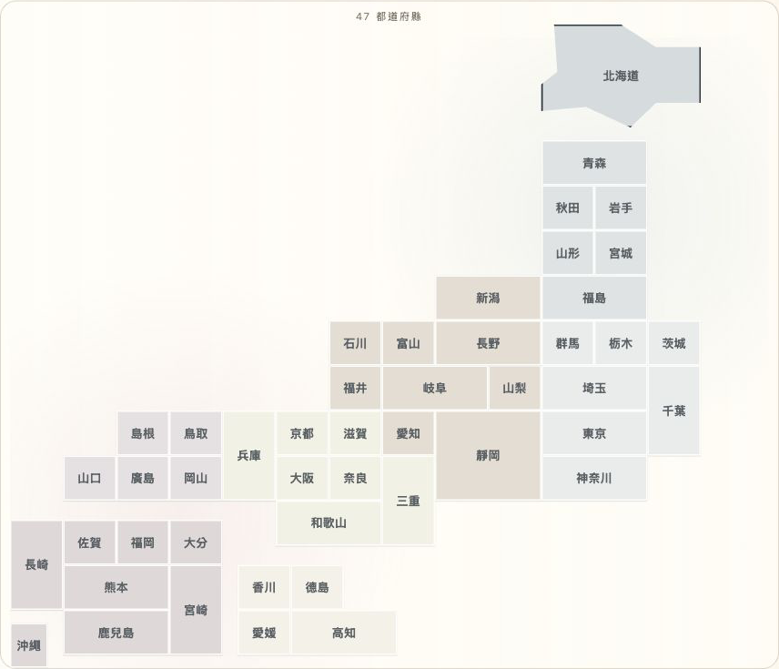

# fanheungha 日本旅行手帳

一個繁體中文、手機優先的日本旅程手帳：集中整理旅程、每日行程、季節執行李、
想買／想食／飲清單、臨出發檢查與下一次想改善的事。Cloudflare D1 是唯一資料
來源；收起內容只會設定 `archived_at`，不會 hard-delete。想買及想食／飲清單可按
店舖分組、排序；已收起項目可以在旅程內還原。

## 先了解安全邊界

第一次開啟空白部署時，必須同時有 Worker secret
`OWNER_SETUP_SECRET` 與六位數 PIN。啟用密碼是 32 bytes（64 個十六進位
字元），只在伺服器端驗證一次，絕不寫入 D1、cookie、前端、回應或 log。PIN
以加鹽 PBKDF2-SHA-256 雜湊保存，session 是雜湊 token 的 Secure、HttpOnly、
SameSite=Lax cookie。連續五次 PIN 錯誤會鎖定 15 分鐘。

不要把使用者旅程、D1 export、`.dev.vars`、production identifier、API token 或
其他 secret 提交到公開 repository。漏洞回報方式見 [SECURITY.md](SECURITY.md)。

## 足跡地圖 demo



足跡地圖以 47 個都道府縣的 CSS cartogram 顯示去過與下一站。這張截圖來自全新
空白 D1，沒有加入使用者旅程、seed 或示例記錄。

## Fresh clone 安裝

需要 Node.js `>=22.13.0`、npm、Cloudflare 帳戶，以及已登入 Wrangler 的部署
者。以下步驟是給公開專案使用者的獨立安裝流程，不是任何受管制的建置／審批
記錄。

```sh
git clone <YOUR_PUBLIC_REPOSITORY_URL> fanheungha
cd fanheungha
npm ci
cp wrangler.jsonc.example wrangler.jsonc
cp .dev.vars.example .dev.vars
openssl rand -hex 32
```

把上一行產生的 64 字元值只填入本機 `.dev.vars` 的
`OWNER_SETUP_SECRET`。編輯 `wrangler.jsonc`，把
`<YOUR_D1_DATABASE_ID>` 換成你新建立的 D1 database ID；不要把真實 ID 或
secret 寫回 example 檔案。

## 建立 D1、生成與本機執行

先建立一個全新的、沒有使用者資料的 D1。命令輸出的 database ID 只應放在未被
提交的 `wrangler.jsonc`：

```sh
npx wrangler d1 create fanheungha-db
npm run db:generate
npx wrangler d1 migrations apply fanheungha-db --local
npm run dev
```

`drizzle/0001_remarkable_thunderball.sql` 是保留 migration 順序的相容性 no-op，
內容刻意只有 `SELECT 1;`；公開 validator 只會對這個檔案放行。其他 migration
只能包含 `CREATE`／`ALTER`／`DROP` schema 或 index DDL，`INSERT`、`UPDATE`、
`DELETE` 一律拒絕，確保新 D1 不會載入使用者資料。

第一次在瀏覽器打開本機網址時，貼上 `.dev.vars` 的 owner setup secret，再設定
六位數 PIN。只有通過這次設定後，才會出現旅程資料介面。

## 部署到 Cloudflare

先在 Cloudflare 控制台或 Wrangler 建立新的空白 D1，並把 ID 填入本機
`wrangler.jsonc`。部署前在乾淨 clone 執行完整檢查：

```sh
npm run db:generate
npm run typecheck
npm run lint
npm run build
npm test
node scripts/validate-public-repo.mjs --check=all
```

確認除 `0001_remarkable_thunderball.sql` 的 `SELECT 1;` 相容性 no-op 外，migration
SQL 只包含 schema／index DDL，而且全部都沒有 seed 或使用者資料，然後套用
migrations 並部署：

```sh
npx wrangler d1 migrations apply fanheungha-db --remote
npx wrangler secret put OWNER_SETUP_SECRET
npx wrangler deploy
```

`wrangler secret put` 會在互動提示中接收 `openssl rand -hex 32` 產生的值；不
要把值放入 shell history、命令列參數、source、issue 或 log。首次部署後只把
這個 secret 只交給需要設定手帳 PIN 的授權使用者。

## 備份與還原

D1 backup 包含 salted PIN hash、session hash 與使用者旅程，必須以私密、加密的
位置保存，不能上傳到公開 repository。部署者可定期輸出：

```sh
npx wrangler d1 export fanheungha-db --remote --output ./private-backup.sql
```

還原前先暫停使用者寫入、驗證檔案來源與 checksum，再由同一個 database 名稱
執行：

```sh
npx wrangler d1 execute fanheungha-db --remote --file ./private-backup.sql
```

還原檔案完成後立即移出工作目錄並依你的加密備份政策保存；不要把它加入 Git。
若是遺失 owner secret，不能從 D1 反推出它，請依 recovery 流程建立新的受控
部署，而不是繞過一次性設定。

## 更新流程

在 maintenance window 內建立新備份，拉取已審核版本，再重新安裝 lockfile 指定
依賴、生成並檢查 migrations，最後先套用 D1 migrations 再部署：

```sh
npm ci
npm run db:generate
npm run typecheck
npm run lint
npm run build
npm test
npx wrangler d1 migrations apply fanheungha-db --remote
npx wrangler deploy
```

不要以 `npm install` 改寫 lockfile，不要跳過 migration inspection，也不要在
更新時清理或刪除 archived rows。

## Recovery 與疑難排解

- **顯示「尚未設定安全的擁有人啟用密碼」**：確認 Worker secret 名稱正是
  `OWNER_SETUP_SECRET`，值是 64 個十六進位字元；重新以 `openssl rand -hex 32`
  生成，不要把值貼進 URL。
- **顯示「啟用密碼不正確」**：確認你連到正確部署，沒有多餘空格或換行；
  secret 不可由瀏覽器或 D1 讀回。若已完成初次設定，端點會拒絕再次 claim。
- **PIN 鎖定**：等候 15 分鐘後再輸入；不要反覆重試。已登入的授權使用者可在
  側邊欄以目前 PIN 設定新 PIN，這會撤銷舊 session。
- **「請先解鎖旅記」**：確認 cookie 沒有被瀏覽器封鎖 Secure cookie，並從
  HTTPS 部署網址開啟；重新輸入 PIN 即可建立新的 opaque session。
- **本機設定後看似沒有登入**：Secure cookie 不會在一般 HTTP 網址保存；用
  HTTPS 本機 proxy／Wrangler HTTPS 預覽，或先在受 HTTPS 保護的部署網址完成
  初次設定，再回到本機檢查。
- **D1 binding 錯誤或空白頁**：檢查 `wrangler.jsonc` 的 `DB` binding、database
  ID、`ASSETS`／`IMAGES` bindings 及 migration 狀態；不要把 production D1 ID
  寫入文件或 issue。
- **migration 失敗**：停止部署，保存錯誤訊息與備份 checksum，檢查 SQL 是否
  為單一 DDL statement（已記錄的 `SELECT 1;` 相容性 no-op 除外）；不要直接刪
  資料表或重跑未審核的 SQL。

遇到無法解決的 runtime 問題時，先保留錯誤時間、版本、非敏感 request path
與 migration 名稱；移除 secret、cookie、使用者內容後再尋求協助。

## 授權與來源

本專案採 MIT License。固定 source snapshot、公開化選擇與排除項目記錄於
`SOURCE_PROVENANCE.md`；依賴 attribution 記錄於 `THIRD_PARTY_NOTICES.md`。

## Release verification

公開 release 會由 tag workflow 產生 draft，並附上可核對的 `SHA256SUMS` 與
SPDX 2.3 `SBOM.spdx.json`。只接受與 package version 完全相符的 annotated、已
簽署 tag；審閱 draft 後才可手動發布。驗證與本機發佈流程見 `RELEASING.md`。
